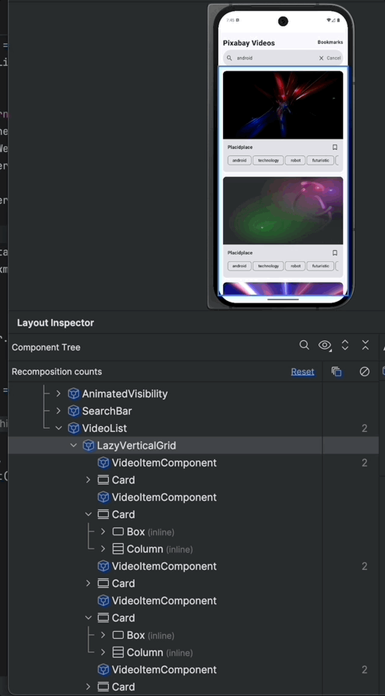
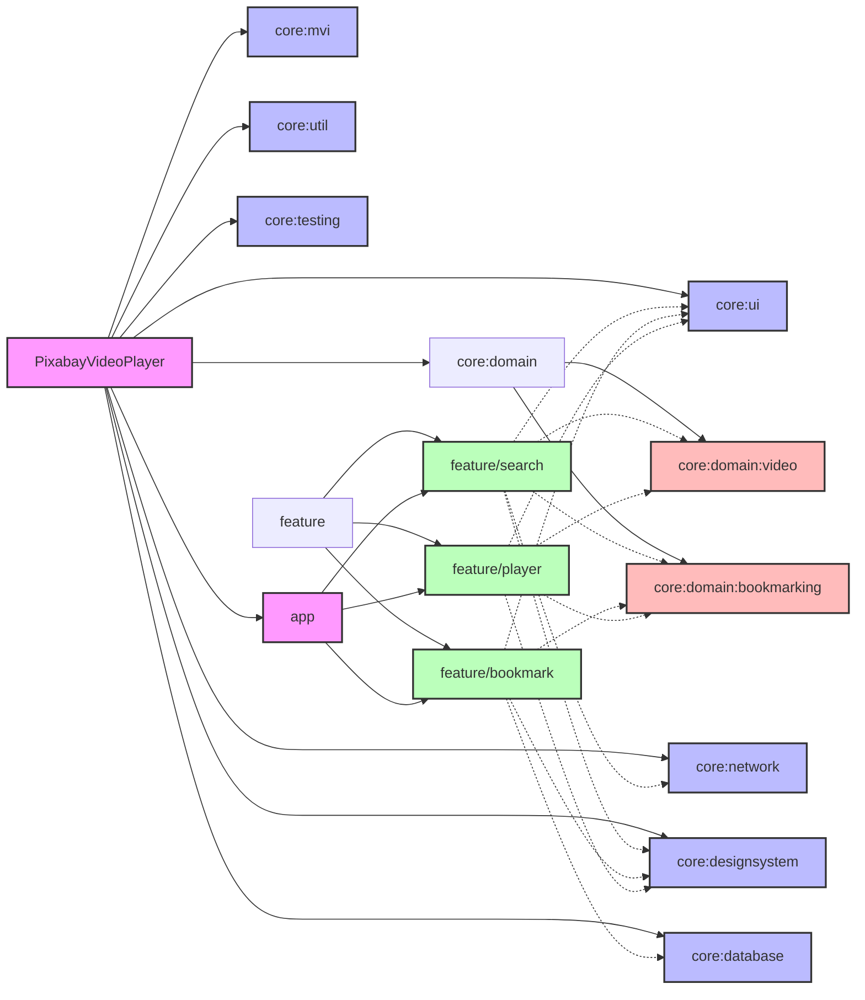

# Pixabay Video Player

A modern Android application for searching, playing, and bookmarking videos from Pixabay. Built with Jetpack Compose and following clean architecture principles.

## 🎥 Demo



*Optimized for Performance: Zero recompositions during navigation and state changes, ensuring smooth and efficient UI updates*

## 🚀 Performance Optimizations

### Zero Recomposition Strategy

The app achieves zero recompositions through several key techniques:

1. **State Hoisting**
   - State is hoisted to the highest necessary level
   - Child composables receive only the data they need
   - Prevents unnecessary recompositions of child components

2. **Remember & DerivedStateOf**
   ```kotlin
   // Example of optimized state handling
   val derivedState = remember(key1, key2) {
       derivedStateOf {
           // Computed value that only updates when keys change
       }
   }
   ```

3. **Stable Interfaces**
   - All data classes are marked with `@Immutable` or `@Stable`
   - Prevents unnecessary recompositions when data hasn't changed
   - Ensures Compose can properly track state changes

4. **Key Usage in Lists**
   ```kotlin
   // Optimized list rendering
   LazyColumn {
       items(
           items = items,
           key = { it.id } // Stable key for efficient updates
       ) { item ->
           ItemComponent(item)
       }
   }
   ```

5. **LaunchedEffect for Side Effects**
   - Side effects are properly scoped
   - Prevents unnecessary recompositions from effect triggers
   - Ensures effects only run when needed

### Benefits

- **Smooth Scrolling**: No jank during list scrolling
- **Efficient Updates**: Only affected components recompose
- **Better Battery Life**: Reduced CPU usage
- **Improved Performance**: Faster UI updates and transitions

## 🎯 Features

- **Video Search**: Search and browse videos from Pixabay
- **Video Playback**: Watch videos with a custom player supporting both portrait and landscape modes
- **Bookmarking**: Save your favorite videos for offline access
- **Responsive UI**: Beautiful Material 3 design with smooth animations
- **Offline Support**: Access bookmarked videos without internet connection

## 🎯 Tech Stack

- **UI**: Jetpack Compose
- **Architecture**: MVI (Model-View-Intent)
- **Dependency Injection**: Hilt
- **Database**: Room
- **Networking**: Retrofit
- **Video Player**: ExoPlayer
- **Build System**: Gradle with Kotlin DSL
- **Language**: Kotlin

## 🏗 Project Structure

The project follows a modular architecture with clear separation of concerns:



### Modules

- **app**: Main application module
- **core**: Common functionality and utilities
  - **ui**: Base UI components and common composables
  - **domain**: Business logic and use cases
    - **bookmarking**: Bookmark-related domain logic
    - **video**: Video-related domain logic
  - **network**: API clients and network utilities
  - **database**: Room database and data access
  - **designsystem**: Theme, colors, and typography
  - **mvi**: State management and ViewModel base classes
  - **util**: Common utilities and extensions
  - **testing**: Test utilities and helpers
- **feature**: Feature modules
  - **search**: Video search functionality
  - **bookmark**: Bookmark management
  - **player**: Video playback

## 🚀 Getting Started

### Prerequisites

- Android Studio Hedgehog | 2023.1.1 or later
- JDK 11
- Android SDK 34 or later

### Installation

1. Clone the repository:
```bash
git clone https://github.com/yourusername/PixabayVideoPlayer.git
```