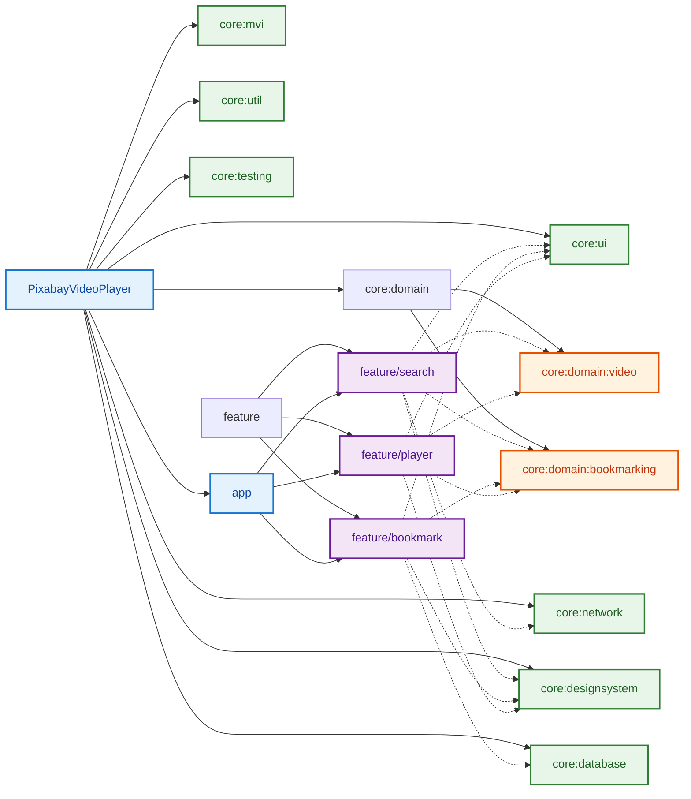

# Pixabay Video Player

A modern Android application for searching, playing, and bookmarking videos from Pixabay. Built with **Jetpack Compose** and **MVI** architecture, featuring robust **state management**, **configuration change** support, and following **clean architecture** principles.

## 🎥 Recomposition Demo


*Zero recompositions achieved through optimized Compose implementation*

## 📥 Download

[Download APK](https://drive.google.com/file/d/1yQOqWPiazq5wucqtAzTiMUZVpgSBybzi/view?usp=sharing)

*Version 1.0.0*

## 🎯 Features

- **Video Search**: Search and browse videos from Pixabay
- **Video Playback**: Watch videos with a custom player supporting both portrait and landscape modes
- **Bookmarking**: Save your favorite videos for offline access
- **Responsive UI**: Beautiful Material 3 design with smooth animations
- **Offline First**: Instant local results with async remote updates when online, seamless offline access when disconnected

## 🎯 Tech Stack

- **UI**: Jetpack Compose
- **Architecture**: MVI (Model-View-Intent)
- **Dependency Injection**: Hilt
- **Database**: Room
- **Networking**: Retrofit
- **Video Player**: ExoPlayer
- **Build System**: Gradle with Kotlin DSL
- **Language**: Kotlin

## 🏗 Project Structure

The project follows a modular architecture with clear separation of concerns:



### Modules

- **app**: Main application module
- **core**: Common functionality and utilities
  - **ui**: Base UI components and common composables
  - **domain**: Business logic and use cases
    - **bookmarking**: Bookmark-related domain logic
    - **video**: Video-related domain logic
  - **network**: API clients and network utilities
  - **database**: Room database and data access
  - **designsystem**: Theme, colors, and typography
  - **mvi**: State management and ViewModel base classes
  - **util**: Common utilities and extensions
  - **testing**: Test utilities and helpers
- **feature**: Feature modules
  - **search**: Video search functionality
  - **bookmark**: Bookmark management
  - **player**: Video playback

## 🔑 API Key

To run the app, you need to:
1. Get an API key from [Pixabay](https://pixabay.com/api/docs/)
2. Add it to `local.properties`:
```properties
PIXABAY_API_KEY=your_api_key_here
```